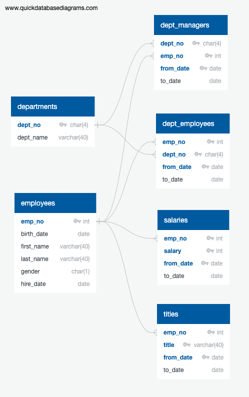

# Employee Retirement Analysis

A fictional company wants to do a review of their employees to get an idea of how many employees will be retiring. This way, the company can prepare retirement packages for retiring employees and recruiting of new hires to take their place. As a guideline, employees born between 1952 and 1955 will begin to retire and only employees hired between 1985 and 1988 are eligible for the retirement package. The data being used is fictional company data consisting of 6 datasets (described in the data section below).

This miniproject explores creating a SQL database and tables using PostgreSQL. The following steps outline the workflow of this project:
1. Create an entity relationship diagram (ERD) with QuickDBD to visualize the data schema
2. Create a new database on pgAdmin
3. Create empty tables for each of the 6 datasets based on the schema
4. Import the 6 data files into the corresponding table just created
5. Perform an analysis (described in the analysis section below) on the data using SQL queries and save the results as new tables
6. Export new tables to CSV files

### Data
 
This ERD was created with [QuickDBD](https://www.quickdatabasediagrams.com/). All files in the `data/raw/quickdbd/` directory were exported from QuickDBD.

- `departments.csv` - all departments in the company
- `employees.csv` - general information for all company employees
- `dept_managers.csv` - department managers (a department may be recorded more than once if it gets a new manager)
- `dept_employees.csv` - department employees (an employee may be recorded more than once if the employee switches to a new department)
- `salaries.csv` - employee salaries (employees may be recorded more than once if their salary changes)
- `titles.csv` - employee titles (employees may be recorded more than once if their title changes)

These tables were created in the database with the code in `schema.sql`. As stated in the comment at the top, uncomment that code block to drop the tables before recreating them.

### Analysis
The analysis of retiring employees in `analysis.sql` consists of queries that output the results to a new table in the database, which is then exported as a CSV file to `data/retirement-analysis/`. The queries performed answer the following questions:
1. Which current employees will be retiring and are eligible for the retirement package?

### Tools used
- [QuickDBD](https://www.quickdatabasediagrams.com/) - a web application for creating ERDs
- [PostgreSQL 12](https://www.postgresql.org/) - one of the most popular database systems
- [pgAdmin 4](https://www.pgadmin.org/) - a database administration interface for PostgreSQL